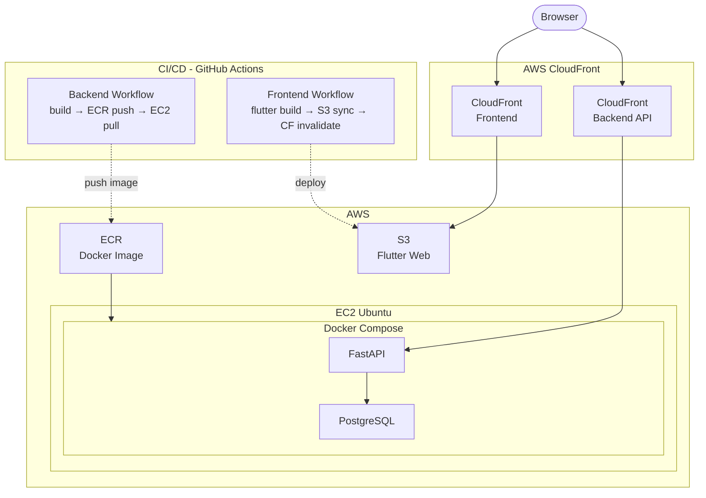

#  Paperef 

**개인 레퍼런스 관리 웹 앱**  
레퍼런스, 링크, 메모, 아이디어를 그룹과 해시태그로 체계적으로 정리하세요.

 

---

## 프로젝트 소개

**Paperef**는 개인 레퍼런스(링크, 메모, 아이디어 등)를 저장하고 체계적으로 관리할 수 있는 풀스택 웹 애플리케이션입니다.  
Flutter Web 기반의 반응형 UI와 FastAPI 백엔드로 구성되어 있으며, 계층형 그룹 구조와 해시태그 필터링을 통해 빠른 검색과 분류가 가능합니다.

AWS EC2, ECR, CloudFront를 활용하여 실제 운영 환경에 배포하였으며, GitHub Actions를 통해 CI/CD 파이프라인을 구성하였습니다.

> 개발 목적: 논문을 쓰는 친구들의 요청으로 논문 작성 시 레퍼런스 링크와 그 메모를 정리하고 한 눈에 볼 수 있도록 개발했습니다.

---

## 주요 기능

| 기능 | 설명 |
|------|------|
| **인증** | JWT 기반 로그인/회원가입, Access Token(30분) + Refresh Token(7일) |
| **계층형 그룹** | 무제한 뎁스의 하위 그룹 생성, 브레드크럼 네비게이션 |
| **레퍼런스 CRUD** | 제목, 요약, 본문, 해시태그 포함 레퍼런스 작성/수정/삭제 |
| **검색 & 필터** | 키워드 검색(디바운싱 500ms), 해시태그 필터, 하위 그룹 포함 여부 토글 |
| **링크 자동 감지** | 본문 내 URL 자동 인식 및 클릭 가능한 링크로 변환 |
| **전체 복사** | 레퍼런스 전체 내용을 클립보드에 복사 |
| **반응형 UI** | iPad 스플릿 뷰, Stage Manager 등 다양한 화면 크기 대응 |
| **비밀번호 재설정** | 이메일 기반 토큰 인증 비밀번호 재설정 |
| **무한 스크롤** | Cursor 기반 페이지네이션으로 레퍼런스를 20개씩 순차 로드, 스크롤 하단 도달 시 자동 추가 요청 |

---

## 기술 스택

### Frontend

- **Flutter Web** — 반응형 크로스플랫폼 UI
- **Provider** — 상태 관리
- **flutter_linkify** — URL 자동 감지
- **url_launcher** — 외부 링크 열기

### Backend

- **FastAPI** — 비동기 REST API 서버
- **SQLAlchemy** — ORM (joinedload, @property 활용)
- **PostgreSQL** — 관계형 데이터베이스
- **JWT** — 인증 토큰 (Access 30분 + Refresh 7일)
- **Pydantic** — 데이터 검증
- **Cursor Pagination** — `updated_at` + `id` 복합 커서 기반 페이지네이션 (Base64 인코딩)

### Infra / DevOps

- **AWS EC2** — 백엔드 서버 호스팅 (Ubuntu 24.04)
- **AWS ECR** — Docker 이미지 레지스트리
- **AWS CloudFront** — 프론트엔드 정적 파일 CDN 배포 / 백엔드 API HTTPS 엔드포인트
- **AWS S3** — Flutter Web 빌드 정적 파일 호스팅
- **Docker / Docker Compose** — 컨테이너 기반 서버 환경 구성
- **GitHub Actions** — main 브랜치 push 시 자동 빌드 및 배포 (CI/CD)

---
## Database Schema

---

## 아키텍처

---

## 📸 스크린샷

> 준비 중

